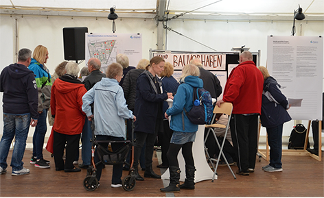
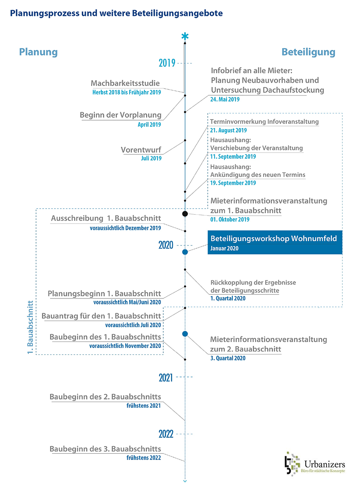

# Dokumentation der 1. Mieterinformationsveranstaltung zum Bauvorhaben im Kietzer Feld &#8211; BBBlockchain Cloud

- Author: degewo
- Date: 2019-12-20
- Time: 07:08:16

## Post

<figure class="wp-block-image size-large"></figure>

Aufgrund ihrer politischen Verpflichtung zum Bau neuer Wohnungen plant degewo die Ergänzung ihres Bestandes durch Neubau und  Dachaufstockung unter anderem auch im Wohngebiet Kietzer Feld. Am 1. Oktober 2019 nahmen mehr als 500 Anwohnerinnen und Anwohner die Möglichkeit wahr, sich über dieses Bauvorhaben zu informieren. An Ständen und Thementischen zum Bau, dem Wohnumfeld und infrastrukturellen Themen gab es die Gelegenheit, Fragen zu stellen sowie Anregungen und Ideen einzubringen. Im Mittelpunkt stand der 1. Bauabschnitt. Eine weitere Veranstaltung zum zweiten Bauabschnitt  ist für das 3. Quartal 2020 geplant. Begrüßt wurden die Besucherinnen und Besucher durch Vertreterinnen und Vertreter degewos und des Bezirksamts. Die Veranstaltung fand in einem Zelt im Wohngebiet statt.

<strong>Zusammenfassung und Auswertung</strong> Die Fragen der Besucherinnen und Besucher wurden direkt beantwortet oder schriftlich festgehalten. Sie wurden im Anschluss ausgewertet und den „Häufigen Fragen zum Bauvorhaben im Kietzer Feld“ hinzugefügt (siehe Seite 7 und 8 im PDF). Diese Liste wird kontinuierlich aktualisiert. Da die notwendigen Bestandsuntersuchungen noch ausstehen, kann degewo derzeit Fragen zum 3. Bauabschnitt nicht abschließend  beantworten. Die Fragen wurden jedoch aufgenommen und werden zu einem späteren Zeitpunkt beantwortet. Kommentare und Ideen wurden an den Ständen und Themen-Tischen auf Kärtchen festgehalten.  Wie oft ein Beitrag geliefert wurde, wurde mit Klebepunkten markiert. Die Kommentare und Vorschläge wurden im Anschluss einzelnen Unterthemen zugeordnet und nach Häufigkeit sortiert. Die Ergebnisse werden im Folgenden zusammengefasst. Eine ausführliche Fotodokumentation der Stände und Themen-Tische kann individuell angefragt werden (Kontaktdaten auf Seite 8 des PDFs).  <strong>Stände zum Bauvorhaben </strong>Die meisten Beiträge seitens der Mieterinnen und Mieter an diesen Ständen waren Verständnis- und Rückfragen zu den Details des  Bauvorhabens. Andere Fragen betrafen das Thema Mietminderungen für Bestandsmieterinnen und -mieter. Andere erkundigten sich nach den Möglichkeiten einer Bewerbung auf die geplanten Wohnungen und nach deren voraussichtlichen Konditionen. Manche kommunizierten  offen, dass sie dem Bauvorhaben ablehnend gegenüberstehen.  Eine häufig formulierte Sorge bezog sich auf die Umsetzbarkeit des Bauvorhabens. Die Mieterinnen und Mieter befürchteten, dass  die Statik der Bestandsgebäude und die Fundamente nicht ausreichen, um die für den 3. Bauabschnitt zu prüfenden Dachaufstockungen zu tragen. Schon heute gebe es Risse in den Wänden, teilweise stehe Grundwasser in den Kellern.

<strong>Thementisch zum Wohnumfeld</strong> Zentrales Thema an diesem Tisch waren die <em>Grünflächen </em>im Quartier. Der Bestand wurde von den Besucherinnen und Besuchern positiv bewertet. Der Pflegezustand sei jedoch verbesserungswürdig.  Die Teilnehmenden wünschten sich daher, dass die Grünflächen erhalten und besser gepflegt werden. Weitere Ideen bezogen sich auf die Einrichtung neuer Hochbeete, begehbarer Dachbegrünungen sowie die Pflanzung weiterer Bäume zwischen den Gebäudeblöcken. Andere Kommentare und Anregungen bezogen sich auf das Thema <em>Naturschutz</em>. Der Baum zwischen den Wohnblöcken Wendenschloßstraße 369-375 und Igelsteig 8-14 sei sehr beliebt. Die geplante Fällung stieß daher auf großen Widerstand. Im Bereich des Kita-Neubaus stehen zwei Rotbuchen, die aus Sicht einiger Mieterinnen und Mieter erhalten werden sollten.  <em>Artenschutz </em>war ein weiteres Thema. Die Teilnehmenden befürchteten, dass Mauersegler, die unter den Dächern brüten, durch die Dachaufstockungen vertrieben würden. Im Allgemeinen wurde die Sorge geäußert, dass der Charakter des Quartiers als Eaherholungsgebiet durch die Baumaßnahmen verloren ginge. Die Mieterinnen und Mieter wünschten sich, dass vor Ort lebende Fledermäuse geschützt werden. Ebenso wurde ein besserer Schutz vor Wildschweinen gefordert.  Ein weiterer Schwerpunkt lag auf dem Thema <em>Spielplätze</em>. Besonders beliebt seien der Spiel- und Sportplatz Ecke Grüne Trift / Zur Nachtheide sowie die Anlage am Igelsteig. Letztere sei ein beliebter Treffpunkt mit dichtem Baumbestand, Schatten und schönen Sitzgelegenheiten. Da dieser dem Bauvorhaben weichen müsse, wurde von vielen ein neuer zentraler Treffpunkt gefordert. Insbesondere für Kleinkinder fehle es an adäquaten Spielmöglichkeiten. Während sich ein Großteil der Teilnehmenden für den Erhalt der bestehenden Spielplätze aussprach, befürchteten andere eine Lärmbelästigung durch neu gebaute Spielplätze und forderten Ruhezeiten ein. Zudem sollten neue Spielplätze nicht zur Schlafzimmerseite der Gebäude ausgerichtet  werden.  Themen waren auch die <em>Müllplätze </em>und <em>Müllentsorgung </em>im Quartier. So wurde beklagt, dass die Anzahl der vorhandenen Mülleimer nicht ausreiche. Müllplätze sollten beleuchtet und mittels Überdachung besser vor Tieren geschützt werden.   Andere Wünsche bezogen sich auf zusätzliche Sitzgelegenheiten, Hundekotbeutelspender sowie eine höhere Präsenz des Ordnungsamtes  im Quartier.

<strong>Thementisch zur Infrastruktur</strong> Das meistdiskutierte Thema war der <em>Autoverkehr</em>. Beklagt wurden die bestehenden Verkehrsprobleme auf der Wendenschloßstraße – insbesondere der morgendliche Stau für PKW und Tram. Es wurde darauf hingewiesen, dass sich diese Situation durch die Neubauprojekte in der Umgebung weiter verschärfen werde. Insgesamt zeigte sich viel Unzufriedenheit mit der Verkehrssituation und Misstrauen, dass die Probleme wirklich gelöst werden können. Als möglicher Lösungsansatz schlugen die Teilnehmenden vor, die Verkehrsberuhigung in der Umgebung der Grünen Trift aufzuheben und diese als alternative Verkehrsroute zu öffnen. Eine andere Idee war die Nutzung der Wasserwege. Den größten Zuspruch erhielt der Vorschlag, eine Brücke über die Dahme in Richtung Grünau für Fuß -, Rad- und Autoverkehr  zu bauen. Im Allgemeinen wünschten sich die Teilnehmenden mehr Bürgernähe bei infrastrukturellen Fragen seitens der Verwaltung und Veranstaltungsformate, zu denen auch andere betroffene Anwohnerinnen und Anwohner aus der Umgebung, nicht nur Mieterinnen und Mieter des Kietzer Felds eingeladen werden. Es wurde Einsicht in das Verkehrskonzept gefordert, das degewo auf Wunsch des Bezirks in Auftrag gegeben hatte. Außerdem wurde gewünscht, dass Mieterinnen und Mieter direkten Kontakt zum Bezirk bezüglich der Verkehrssituation aufnehmen können.  Ebenfalls zentral war das Thema <em>Parken</em>. Die Teilnehmenden sorgten sich um die Verfügbarkeit von Parkplätzen während der Bauphase, ob die Parkplätze für die neuen Mieterinnen und Mieter ausreichen werden und was mit den bestehenden Garagen passieren wird. Es wurde vorgeschlagen, Verhandlungen mit den Supermärkten in der Wendenschloßstraße aufzunehmen, um nächtliches Parken für Mieterinnen und Mieter zu erlauben. Hinter den bestehenden Kleingaragen wurde außerdem ein brachliegendes Gelände identifiziert. Vereinzelte Wünsche bezogen sich auf die Installierung von Elektroladesäulen und die Einrichtung von Motorradstellplätzen  Stark diskutiert wurde die <em>Anbindung an das öffentliche Verkehrsnetz</em>. Die Tramlinie wurde als unzureichend bewertet, bei Unterbrechungen  im Betriebsverkehr würde kein Ersatzverkehr eingerichtet. Es wurde vorgeschlagen, dass die Tram öfter fährt oder längere Züge bekommt und zudem an den S-Bahn- Ring angebunden wird. Des Weiteren wurde  die Einrichtung einer neuen Buslinie über die Grüne Trift sowie eine Busanbindung nach Schöneweide oder Spindlersfeld gewünscht.  Thema war auch der <em>Radverkehr</em>. Einige Mieterinnen und Mieter wünschten sich den Ausbau des <em>Fahrradwegnetzes </em>im Ortsteil Wendenschloß. Häufig wurden auch neue <em>Fahrradstellplätze </em>gewünscht. Diese sollten als Fahrradgaragen überdacht und abschließbar sein und auch das Abstellen von Kinderwägen, Elektrorollern und Rollstühlen ermöglichen.  Die Teilnehmenden beklagten darüber hinaus Engpässe und <em>Kapazitätsprobleme in den örtlichen Schulen</em>. Die geplante Kita wurde  von der Mehrheit befürwortet. Es wurde jedoch auf eine leerstehende Kita in der Umgebung verwiesen, welche als alternative Räumlichkeit  geprüft werden solle. Es wurde außerdem der Bedarf an Jugendclubs betont, insbesondere, weil Jugendliche zurzeit die Kleingaragen  als Aufenthaltsräume nutzen, die im zweiten Bauabschnitt entfallen werden.   Die <em>ärztliche Versorgung</em> im Ortsteil Wendenschloß sei problematisch. Es fehlen Allgemein- und Fachärzte, ein neues Ärztezentrum würde benötigt. Ebenso wünschten sich die Teilnehmenden Wohnangebote für ältere Menschen wie z.B. eine Pflegeeinrichtung und Betreutes Wohnen.  Bedingt durch die geografischen Gegebenheiten  und angesichts der Verkehrsproblematik sorgten sich die Teilnehmenden außerdem um <em>Sicherheitsthemen</em>. Es wurde mehrfach nach geplanten Hubschrauberlandeplätzen und Möglichkeiten der Evakuierung gefragt.  Die <em>Einkaufsinfrastruktur </em>wurde von den meisten als ausreichend beschrieben. Einzelne wünschten sich die Ansiedlung von Banken, einer Kneipe sowie Supermärkten im Süden der Wendenschloßstraße.

<figure class="wp-block-image size-large"></figure>

<a href="../wp-content/uploads/2019/12/191107_Kurzdoku_KF-final.pdf">191107_Kurzdoku_KF-final</a>

