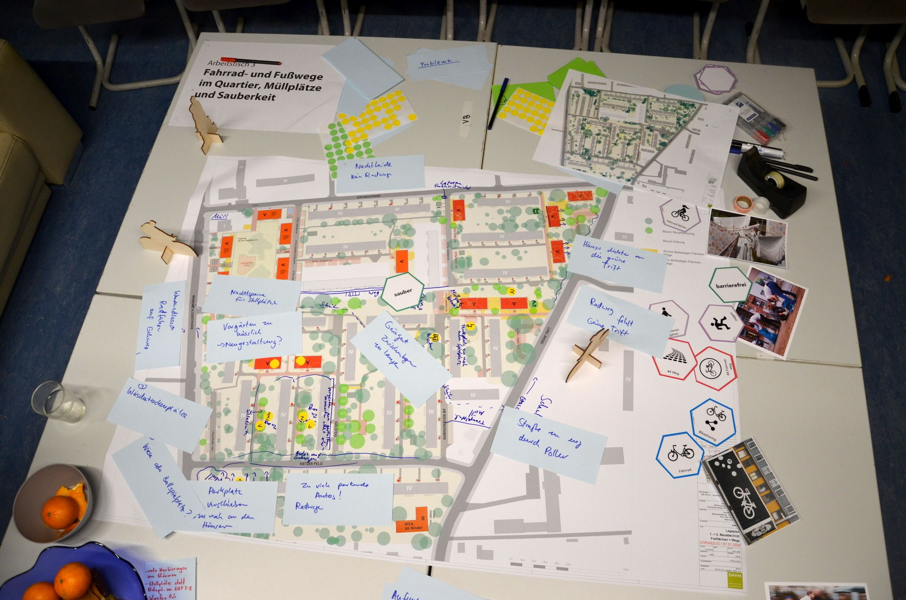
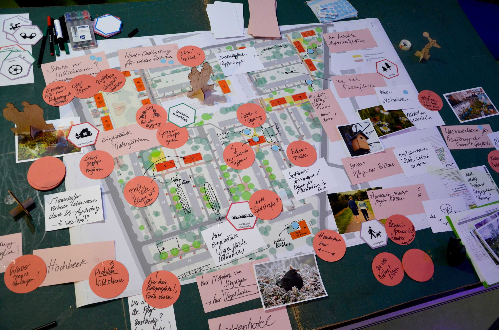

# Workshop zur Wohnumfeldgestaltung im Kietzer Feld

- Author: degewo
- Date: 2020-01-31
- Time: 12:36:00

## Post

<strong>Am 15.01.2020 in der Zeit von 17.00 – 19.00 Uhr fand der erste Workshop zur Wohnumgeldgestaltung des Kietzer Feldes statt. </strong>

Rund 30 Mieterinnen und Mieter fanden den Weg in den Kietz Klub Köpenick. Im Rahmen des Workshops hatten die Teilnehmenden die Möglichkeit, ihre Bedarfe und Ideen zu möglichen Gestaltungsvarianten der zukünftigen Grün- und Freiräume im Kietzer Feld näher zu beschreiben. 

<figure class="wp-block-image size-large"></figure>

<strong>Die Gespräche fanden an drei Thementischen zu folgenden Themen statt: </strong>

• Thementisch 1: Grünflächen, Natur- und Artenschutz • Thementisch 2: Aufenthaltsorte und Spielflächen  • Thementisch 3: Fahrrad- und Fußwege im Quartier, Müllplätze und Sauberkeit 

An den Thementischen wurde angeregt und teils kontrovers diskutiert. Viele Anregungen gab es zum Schutz der Flora und Fauna im Wohngebiet wie z.B. Nistkästen, Vogelhecken, Begrünung als Schall- und Sichtschutz sowie Blühwiesen. Auch Treffpunkte im Quartier wie Gemeinschafts-/Mietergärten, Spielplätze, Sitzecken für verschiedene Zielgruppen sowie ein Raum für die Nachbarschaft wurden diskutiert. Zudem gab es Vorschläge zur Gestaltung zukünftiger Fahrradstellplätze und neuer Orte für den Hausmüll. Sicherheit und eine gute Beleuchtung waren den Teilnehmenden dabei besonders wichtig. 

Die Ergebnisse des Workshops werden Ihnen in einer Planungszeitung veröffentlicht und bei der weiteren Planung berücksichtigt. 

<figure class="wp-block-image size-large"></figure>
