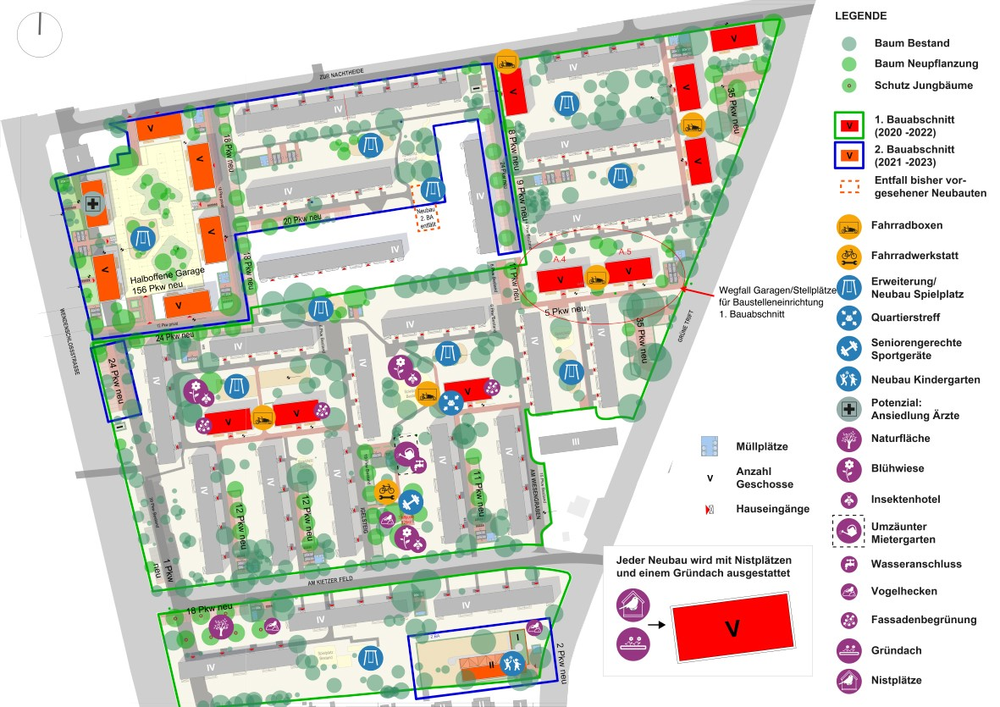

# Sichtbare Veränderungen ab November 2020 &#8211; BBBlockchain Cloud

- Author: degewo
- Date: 2020-06-29
- Time: 09:34:13

## Post

Mit der Beauftragung des Generalübernehmers schreitet unser Bauvorhaben voran. Wir beginnen im November mit bauvorbereitenden Maßnahmen. Hierdurch wird es zu den ersten Veränderungen in Ihrem Wohnumfeld kommen. 

Wie bereits angekündigt, werden nun Garagen und Stellplätze für die ersten beiden Wohngebäude des 1. Bauabschnitts weichen müssen. Den genauen Standort haben wir in der beigefügten Karte für Sie markiert. 

<figure class="wp-block-image size-large"></figure>

Mit dem Abbruch der Garagen beginnen wir im November. Danach wird hier die Baustellenlogistik eingerichtet werden. Die ersten Kündigungen von Garagenmietverträgen werden daher in Kürze versandt.  Ersatzgaragen und -stellplätze können wir leider nicht anbieten, da diese im Quartier nicht vorhanden sind. Alle Garagen- und Stellplatzmieter, die ihre Garage bzw. Stellplatz nun aufgeben müssen, können sich bereits jetzt unverbindlich für einen Außenstellplatz oder einen Tiefgaragenplatz vormerken lassen.

<a href="../wp-content/uploads/2020/06/200507_KFELD_VPL_Lageplan_Planungszeitung-A4_5_BBBlockchain-1.pdf">Lageplan Kiezer Feld</a><a href="../wp-content/uploads/2020/06/200507_KFELD_VPL_Lageplan_Planungszeitung-A4_5_BBBlockchain-1.pdf" class="wp-block-file__button" download>Herunterladen</a>

